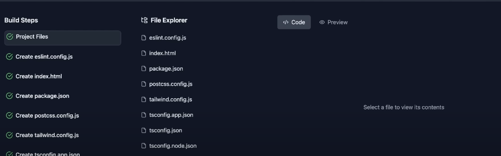

# Bolt Clone (V0 Clone Project) 

## Project Overview
This project was an attempt to create a clone of V0 (v0.dev), a generative user interface tool by Vercel. The goal was to create a system that could generate complete applications using AI, similar to how V0 generates UI components.

## Architecture

### Frontend (`bolt.clone/frontend`)
The frontend was built using React/TypeScript and designed to:
- Display generated project steps and code
- Provide a file viewer/editor interface
- Handle project generation workflow
- Show real-time generation progress

#### Key Types
- `StepType`: Different actions that can be performed (CreateFile, EditFile, CreateFolder, etc.)
- `Step`: Individual generation steps with status tracking
- `Project`: Collection of steps and the original prompt
- `FileItem`: File system representation for the viewer

### Backend (`bolt.clone/be`)
The backend was built with Node.js/Express and integrated with Google's Gemini AI. It was designed to:
- Handle project template generation
- Manage chat-based interactions with the AI
- Determine project type (React vs Node.js)
- Stream AI responses for real-time feedback

## Technical Stack
- **Frontend**: React + TypeScript
- **Backend**: Node.js + Express
- **AI Model**: Google Gemini 1.5 Flash
- **API Communication**: REST endpoints

## Current State
The project is currently incomplete due to technical complexity. Main challenges included:
- Complex AI prompt engineering required for reliable code generation
- Handling real-time file system operations
- Managing state between AI generations and file system
- Coordinating multiple generation steps

## Future Development Plans
1. Improve AI prompt engineering for more reliable code generation
2. Implement proper file system handling
3. Add better error handling and recovery
4. Implement proper project scaffolding
5. Add support for different frameworks/libraries
6. Improve the UI/UX for the generation process

## Learning Outcomes
This project provided valuable insights into:
- AI-assisted code generation
- Real-time communication between frontend and backend
- Complex state management in full-stack applications
- Challenges in building developer tools

